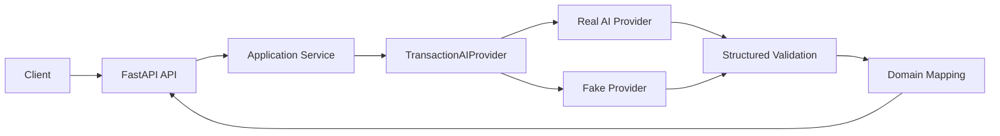

# Architecture

## Initial Context

## Responsibilities

### API
HTTP transport, status codes, request validation, DI wiring.

### Application Service
Parse workflow orchestration and later cache/idempotency integration.

### Provider
Provider HTTP/config/request/response/error mapping.

### Validation Boundary
External model output is untrusted:
1. provider/structure validation;
2. domain invariants;
3. safe public mapping.

## Async

Day 04 measures this.

Expected principle:
- provider HTTP is I/O-bound;
- async can improve concurrency/worker utilization;
- it does not reduce the provider's own intrinsic latency;
- HTTP client lifetime should permit connection pooling.

## State

Local cache/jobs/idempotency introduced in the lab are explicitly process-local unless externalized.

## Monyvi Decision Questions

At Day 14:
- what concrete benefit does Python provide?
- extra network hop?
- extra deployment/runtime?
- auth/secrets/logging/observability cost?
- can existing Edge Functions meet the need more simply?
- is polyglot operation justified?
